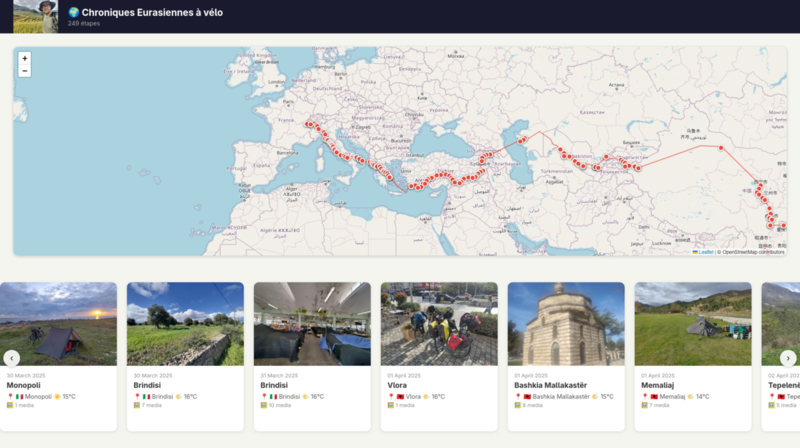
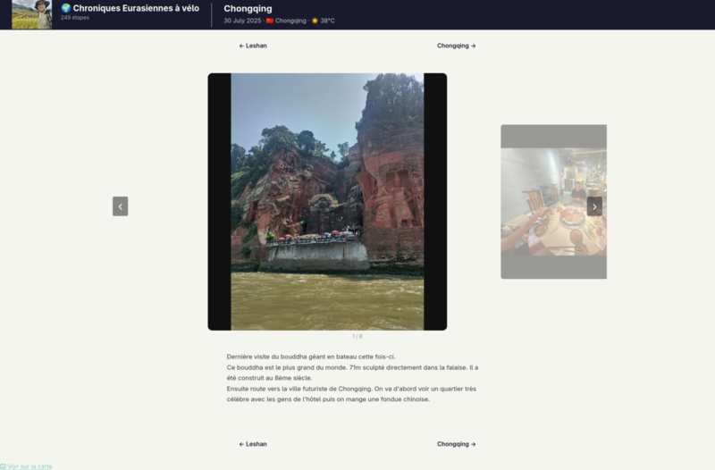

# 🗺️ Polarust

Générateur de site statique pour carnets de voyage, écrit en Rust.

Polarust transforme une archive de voyages (photos, vidéos, métadonnées JSON)
en un site web HTML complet avec carte interactive, galerie et pages par étape.

## Fonctionnalités

- 📂 Parse automatiquement les dossiers de voyages depuis une archive locale
- 🗺️ Carte interactive avec tracé GPS et marqueurs par étape
- 🖼️ Génération de thumbnails JPEG optimisés

## Utilisation

```bash
cargo run -- lien_vers_dossier_trip --output www
```

Télécharger votre archive depuis Polarstep. Dézipper là puis donner le liens vers le sous dossier trip.

## Galerie



